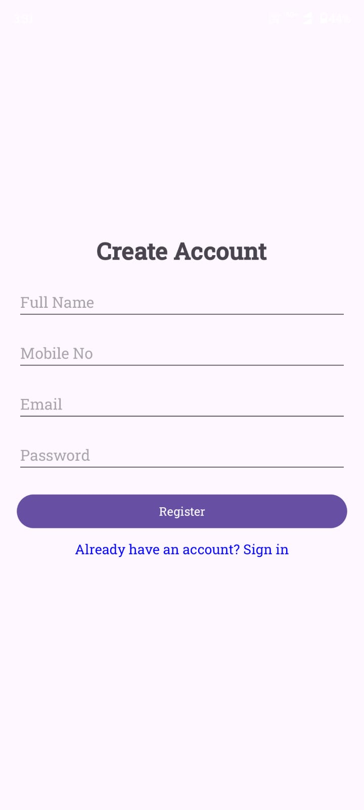
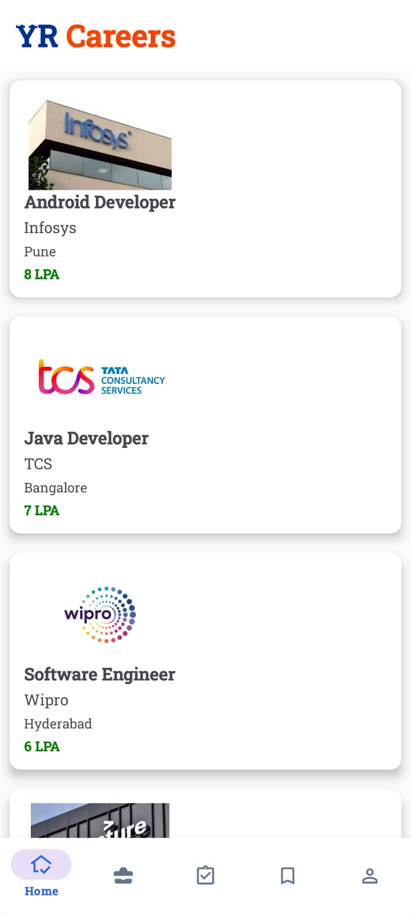
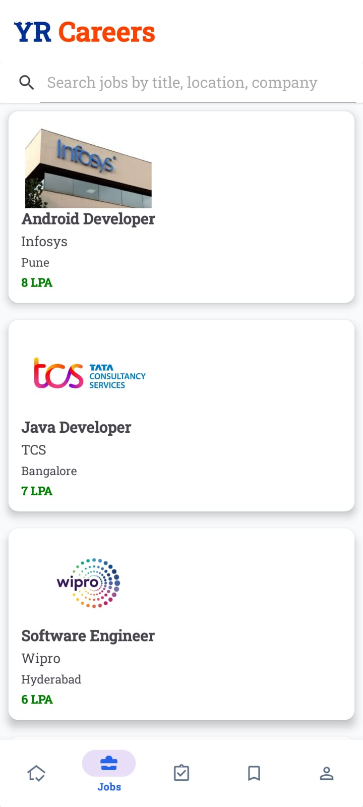
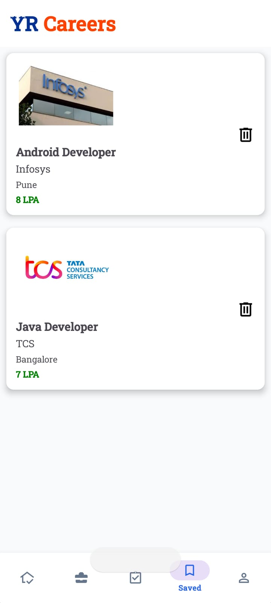
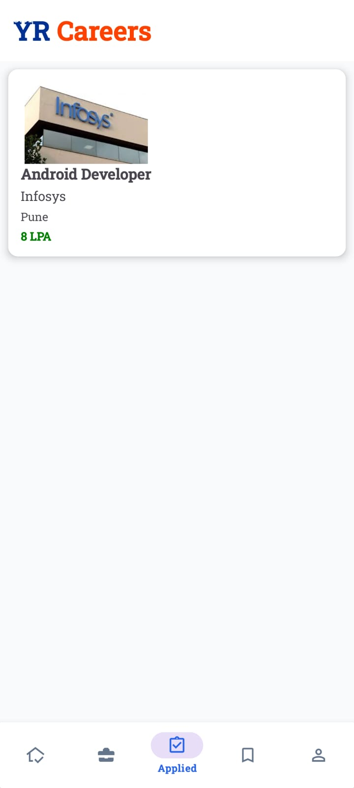

# YR Careers – Job Portal App

YR Careers is an Android Job Portal application built using Java and Firebase. 
The app enables users to search and apply for jobs, save jobs, receive notifications, and manage their profile efficiently.

## Features

* User Registration and Login
* Email Login and Phone Number Login
* Email Verification
* Firebase Authentication
* Search Jobs by Title
* Search Jobs by Company Name
* Search Jobs by Location
* View Job Details
* Save and Remove Saved Jobs
* Apply for Jobs
* View Applied Jobs
* Job Notifications
* User Profile Management
* Bottom Navigation Interface
* Material Design UI
* Cloud Firestore Database Integration

## Technologies Used

* Java
* Android Studio
* Firebase Authentication
* Cloud Firestore
* RecyclerView
* Material Components

## 📸 Screenshots

### Splash Screen

### Login Screen

### Register Screen

### Home Screen

### Jobs Screen

### Saved Jobs Screen

### Applied Jobs Screen

### Profile Screen

## Project Architecture

* Activities
* Fragments
* Adapters
* Models
* Firebase Services

## Installation

1. Clone the repository.
2. Open the project in Android Studio.
3. Connect Firebase to the project.
4. Sync Gradle files.
5. Run the application on an emulator or Android device.

## Future Enhancements

* Resume Upload Feature
* Admin Panel
* Dark Mode Support
* Advanced Job Filters

## Author

Yash Raj

Android Developer
